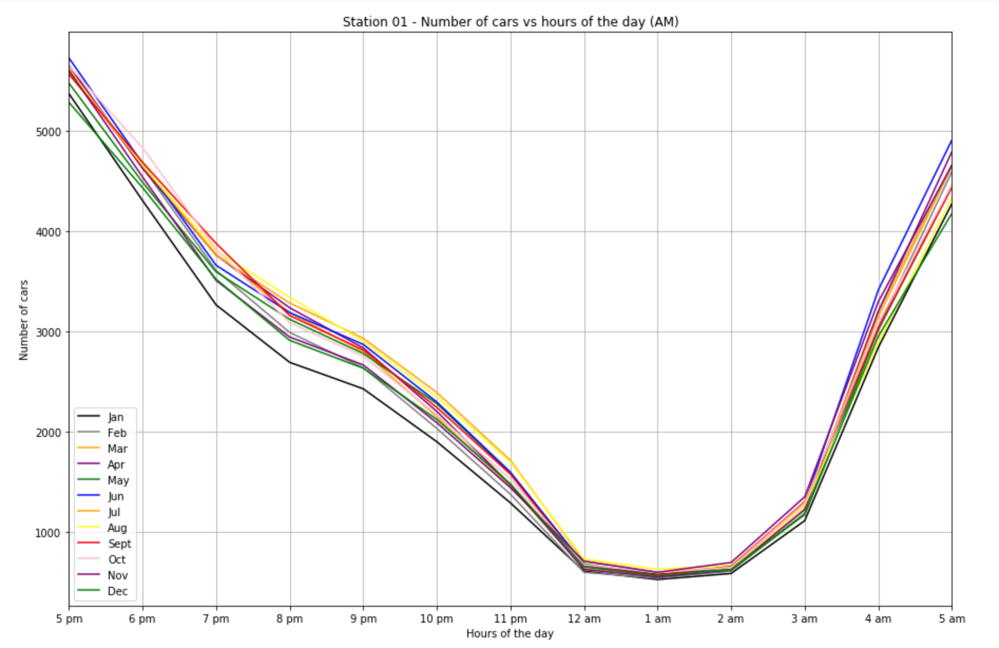

# Big Data Hackathon for San Diego 2019
## Day 1, MAR 9: Proposal Submission Guidelines
> - Customize the Proposal Form (proposal_submission_form.md) in your team GitHub repository **by 4:30 p.m.**
> - 90 seconds Pitch Presentation will show the top part of the form on the screen
> - 90 seconds Pitch Presentation will show the top part of the form on the screen

## Day 2, MAR 16: Final Project Submission Guidelines

### Light Smart

<b>Objective</b>:

* Reduce light pollution and energy consumption from city street lights

<b>Background</b>:
* The City of San Diego is spending approximately $5,610 for 40,000 lights for 11 hours. That is $2,044,000 million per year.  Which produced approximately 922,931lx during the night hours.  Which raises the light level of the city by about 0.338lm/ft2 which is 3x more than the average brightness of the moon.
* Artificial lights can lead baby sea turtles to their demise
* Sea turtles live in the ocean but hatch at night on the beach.
  * Hatchlings find the sea by detecting the bright horizon over the ocean. Artificial lights draw them away from the ocean. In Florida alone, millions of hatchlings die this way every year.
* Effects of dimming light-emitting diode street lights on light-opportunistic and light-averse bats in suburban habitats
* It is possible to achieve a light intensity that provides both economic and ecological benefits by providing sufficient light for human requirements while not deterring light-averse bats.
* Humans evolved to the rhythms of the natural light-dark cycle of day and night (circadian rhythm). Research suggests that artificial light at night can negatively affect human health, increasing risks for obesity, depression, sleep disorders, diabetes, breast cancer and more.

<b>Our Solution:</b>
* Using the city regulations for acceptable illuminance levels, we have designed policies and procedures for smart traffic light network using our luminosity control system to dynamically adapt with the changing traffic situations.

<b>How it works:</b>
* The street lights are IoT enabled. They can talk to each other and to the central server sitting on the cloud.
* Each street light will record the traffic conditions of the road using a camera and various other sensors
* Each street light will dynamically compute the optimal brightness needed for that particular traffic condition and share the results of the computation with other nearby lights and with the cloud server.
* Over time, these lights will get more accurate and learn to be intuitive using machine learning algorithms.
* This will enable us to predict the power consumption and costs down the road for the whole city.

<b>Our Findings:</b>

* Datasets
  * US department of Transportation, US traffic 2015
      * The above dataset was used to determine traffic density for locations found within San Diego City. This dataset included hourly measurements of traffic (number of cars) taken every day of the year for 2015
  * San Diego Street Light locations (SCALE SD)
      * Using the streetlight locations, we found that the majority of lights are induction type bulbs. In 2011, the city of San Diego added 35,000 induction bulbs because they were more economical and ecological.

* We found a radius (5 miles) of street lights between north park and city heights where traffic information was capture. The traffic data was filtered by each month. A comparison chart was created to determine traffic patterns. We found that the traffic patterns are similar throughout the year. The below graph illustrates traffic patterns throughout the year during the night.

* We separated the traffic into three categories (low, medium, high). Because cars can produce effective lighting for the environment (depending on the number of cars) we can lower the luminosity from the street lights.  
  * During no traffic (still cars on the road) we will use the guidelines recommended by City of San Diego Street Lighting (6.0 lux)
  * During low traffic load we are using highest wattage for lights (10.0 lux)
  * During medium traffic load we are using medium wattage for lights (8.0 lux)
  * During high traffic load we are using low wattage for lights (6.0 lux)
  * For pedestrians and cyclist we will use optimal lighting levels (3.0 lux)

<b>Visualization:</b>
* First Visualization
  * Interactive map of the street lights that are present in San Diego Currently. Our project is to show the benefit of smart lights and how they can help you save cost and the environment. Click on the lights to turn them to smart lights and contribute to the savings.
    * When you turn one street light to a smart street light
    * You save xx in cost
    * Xx in wattage
    * Xx in lux
* Second visualization
  * It is a 24 hrs simulation of highway 805. There is a traffic station in the middle that records everyday traffic data by the hour. The simulation is the traffic flow from 6pm to 6pm the next day where the normal lights give out the same lux of light but the smart light dims and brightens as necessary saving x amount of lux and y amount of dollars.

<b>Other Applications:</b>
* Parking:
  * Can identify empty spots on the street and notify parkers thru an app.

* Crime:
  * System can be trained to identify any suspicious or abnormal activities.

* Accidents:
  * Can identify accidents, promptly report the authorities and tell the factors leading to the accident.
* Wildlife:
  * In the future, identify lighting near San Diego’s wildlife refuges, and reduce lighting when safe for nocturnal species, such as bats.
* Astronomy & Space Science:  
  * In the future work with Palomar Observatory (CalTech) and NASA, to measure cumulative illuminance (lux) levels regionally for the City of San Diego and eventually San Diego County. Goal to reduce light pollution in the San Diego metropolitan region.  

<b>Extended Features:</b>
* AI
  * With increase usage overtime the smart lights will create more accurate predictions for light fluxuations, traffic reporting, parking etc. etc.
* Wisdom of Crowd:
  * Since every system has its own data, different systems could learn more from each other by sharing data.
  * These smart lights can give live traffic updates that are more accurate than those of Apple and Google Maps.
  * Since this is a network of lights, the lights can communicate with each other to better control traffic.
  * Since the lights can communicate, if a sector of lights go down the surrounding smart lights will optimize the environment to create predictions for traffic and light requirements

<b>Conclusion:</b>
* Savings
  * We estimate that under the new system we could save $2,800 per night to operation which would come out to almost $1,000,000 a year
* Light Pollution reduction 
  * Wes estimate that we could reduce the light pollution by 419,316lx from approximately 40,000 lights across San Diego, which would raise the overall brightness of the city by approximately 0.114 lm/ft2
